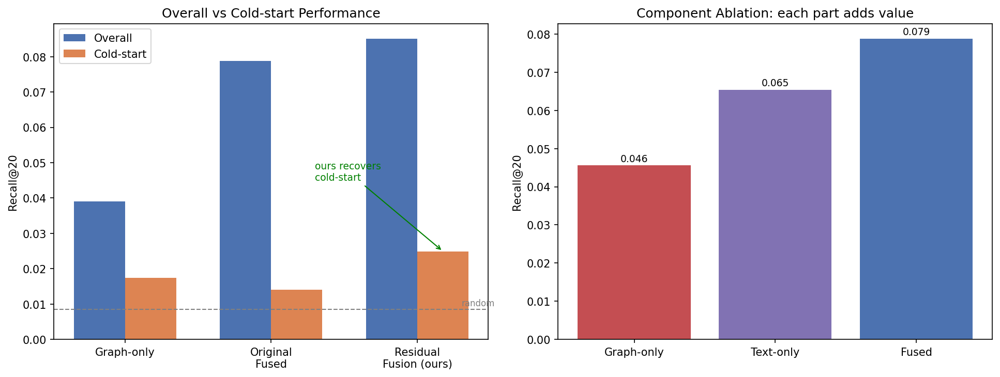
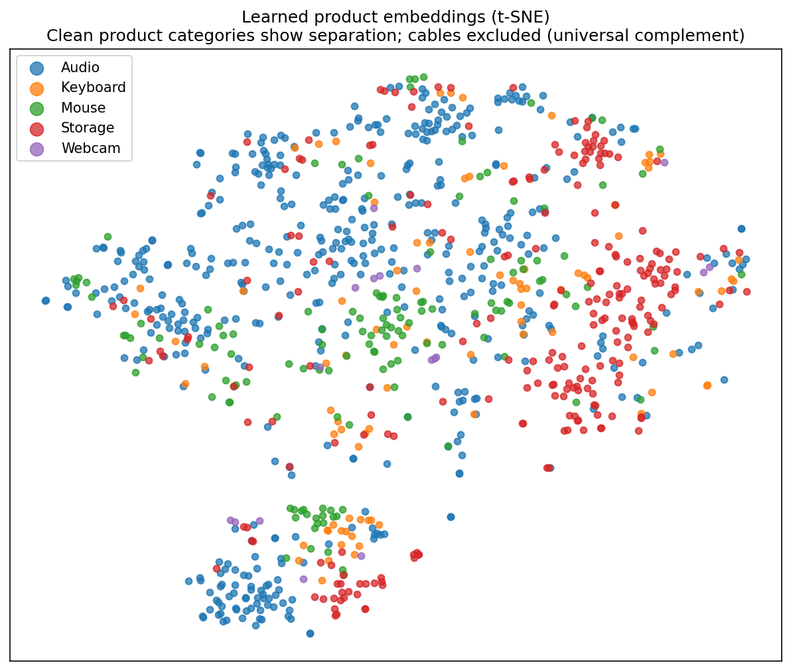

# 🛒 Hybrid Multimodal Product Recommendation System
### Graph Neural Networks + Transformer Embeddings, with a cold-start-robust fusion architecture

> An e-commerce recommender that fuses **co-purchase behavior** (a GNN over a product graph) with **semantic product understanding** (BERT text embeddings). It addresses the cold-start problem — recommending products with little or no purchase history — and explains *why* each product is recommended.

**🔗 [Try the live demo](https://huggingface.co/spaces/rudranil7/hybrid-product-recommender)** &nbsp;|&nbsp; Built with PyTorch, PyTorch Geometric, Sentence-Transformers

---

## TL;DR

Standard GNN + text fusion **breaks at cold-start** — when a product has no co-purchase edges, the text signal gets distorted by graph-trained weights. I diagnosed this with a controlled experiment, then designed a **residual-fusion architecture** that preserves a direct text pathway. The result: cold-start recommendation quality improves **+76%** over naive fusion, while overall accuracy also improves.

| Model | Overall Recall@20 | Cold-start Recall@20 |
|---|---|---|
| Graph-only (GNN, no text) | 0.0390 | 0.0174 |
| Text-only (BERT, no graph) | 0.0654 | — |
| Naive Fusion (BERT + GNN) | 0.0788 | 0.0141 |
| **Residual Fusion (this work)** | **0.0851** | **0.0249** |

*(Random baseline ≈ 0.0085. Cold-start measured by simulating edge removal on warm products — see Experiments.)*

---

## The Problem

Recommenders rely on behavioral signal ("people who bought X also bought Y"). But a **newly listed product has no purchase history**, so a purely behavioral model can't place it. This is the **cold-start problem**. The intuition behind this project: a product's *text* (title, description) is available from day one, so a model that understands text can recommend new products before any behavioral data exists.

## Approach

Two signals per product, fused into one representation:

- **Behavioral / relational** — a **co-purchase graph** where products are nodes and an edge connects two products reviewed by the same user. A 2-layer **GraphSAGE** GNN passes messages along these edges so each product's representation absorbs its co-purchase neighborhood.
- **Semantic / content** — product text (title + features + description) encoded with **Sentence-BERT (`all-MiniLM-L6-v2`)** into 384-dim embeddings. These serve as the GNN's input node features and, critically, as a fallback signal for cold products.

The model is trained **self-supervised** via link prediction with BPR loss and negative sampling — no manual labels; the graph's own edges are the supervision.

## Key Contribution: Residual Fusion for Cold-Start

A naive GNN routes text features *through* graph-convolution layers whose weights are trained assuming neighbors exist. Remove a product's edges (cold-start) and those layers distort the text signal — performing **worse than raw BERT alone**.

The fix is a **skip connection** that preserves a direct text pathway:

```
final_embedding = GNN(text, graph)  +  Linear(text)
                  └─ graph pathway ─┘    └─ text pathway ─┘
```

The text pathway survives even when a product has zero edges, so the model **degrades gracefully** to a content-based recommender for cold products instead of collapsing.

---

## Experiments & Results

**Dataset:** [Amazon Reviews 2023](https://huggingface.co/datasets/McAuley-Lab/Amazon-Reviews-2023) (McAuley Lab), *Electronics* category. Filtered to a **5-core** (each user and product has ≥5 interactions), yielding **2,351 products**, **2,556 users**, **24,104 interactions**, and **9,642 weighted co-purchase edges** (kept only pairs co-reviewed by ≥2 users to denoise). Evaluation uses a leakage-checked 90/10 edge split — held-out edges are removed from *both* the loss and the message-passing graph.

### 1. Ablation — each component adds value
Graph-only (0.046) < Text-only (0.065) < Fused (0.079) Recall@20. Text alone beats graph alone here because the graph is sparse (0.4% density); fusion beats both.

### 2. Cold-start — the core result
Simulated by removing a warm product's edges at inference (holds ranking difficulty constant, n=922):

| Model | Normal R@20 | Cold-sim R@20 | Drop |
|---|---|---|---|
| Graph-only | 0.0390 | 0.0174 | −56% |
| Naive Fusion | 0.0748 | 0.0141 | −81% |
| **Residual Fusion** | 0.0792 | **0.0249** | **−69%** |

Naive fusion drops hardest (text distorted by graph weights). Residual fusion retains the most cold-start signal **and** lifts overall Recall@20 from 0.0788 → 0.0851.

> **Honest note:** Residual fusion's overall NDCG@20 dipped slightly (0.0335 → 0.0304) — it surfaces the right item more often (higher recall) but ranks it marginally lower on average. A real trade-off, reported rather than hidden.

### 3. Learned structure & explainability
A t-SNE of the learned embeddings shows distinct categories (Audio, Storage) separating, with input peripherals bridging clusters — consistent with real co-purchase overlap. The demo decomposes each recommendation into its **text vs. co-purchase contribution**.




---

## Tech Stack
`PyTorch` · `PyTorch Geometric (GraphSAGE)` · `Sentence-Transformers (BERT)` · `Gradio` · `Hugging Face Spaces`

## Repo Structure
```
├── notebook.ipynb        # full pipeline: data → graph → embeddings → train → eval
├── app.py                # Gradio demo (deployed to HF Spaces)
├── requirements.txt
├── results_plots.png     # ablation + cold-start charts
├── embedding_map.png     # t-SNE of learned embeddings
└── README.md
```

## Run It Yourself
```bash
pip install torch torch_geometric sentence-transformers gradio
# open notebook.ipynb and run top-to-bottom (a GPU helps but isn't required)
# or launch the demo locally:
python app.py
```

## Limitations & Future Work
- **Scale:** validated on a 2,351-product core; neighbor sampling would be needed for the full catalog (millions of items).
- **Graph sparsity:** 0.4% density limits the behavioral signal; denser categories or longer interaction windows would help.
- **Image modality:** the architecture extends naturally to a third (vision-transformer) pathway for product images — a planned extension.
- **Adaptive fusion:** a degree-aware gate that learns per-product text-vs-graph weighting is a promising refinement.

---

## Author
**Rudranil Chakraborty** 

*Built as a learning project exploring graph + language-model fusion for recommendation. Feedback welcome.*
